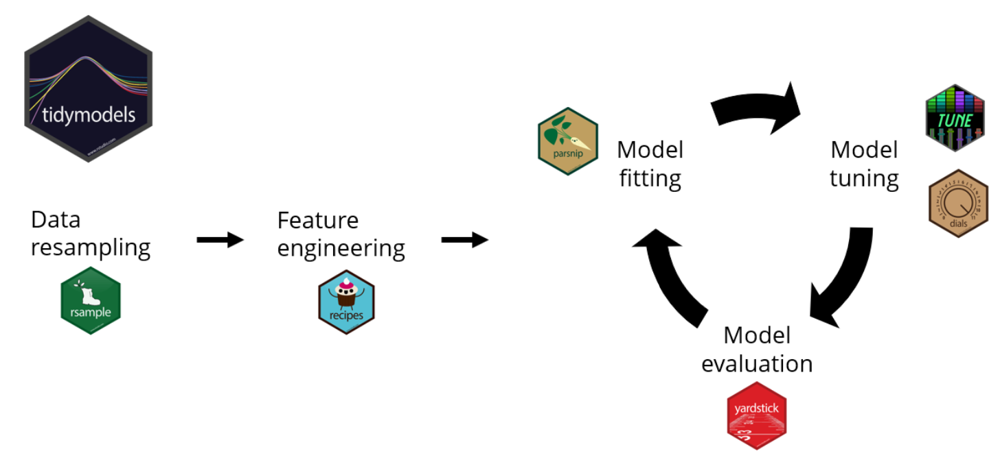

```{r setup, include = FALSE}
knitr::opts_chunk$set(
  warning = FALSE,
  message = FALSE
  # cache = TRUE
)
```


## 1. Basic modeling in `tidyverse`

Before even going to `tidymodel`, the `tidyverse` packages provide ways to streamline fitting common statistical models.

### 1.1 `tidyverse` modeling workflow

1.  Make a **list column** `nest()`

2.  Work with **list columns** `map()`

`map(.x, .f = ~mean(.x))` Can work with `broom`, `Metrics`, `rsample` etc.

3.  Simplify the **list_columns** `unnest()`

4.  model presentations `broom::tidy()`

-   `tidy()` for model coefficients

-   `glance()` one row summary of the model, e.g. R\^2

-   `augment()` adds prediction column to the original data

```{r}
library(tidyverse)
library(tidymodels)

gapminder = readRDS("~/Dropbox/Coursework/Machine Learning in R/Machine Learning in the Tidyverse/datasets/gapminder.rds")

## Step one is to make a list column based on the grouping variable
nested = gapminder %>% group_by(country) %>% nest()

## 1. Example 1) calculating the mean of a column 
nested %>% 
  mutate(pop_mean = map(data, ~mean(.x$population))) %>% 
  unnest(pop_mean)

## 2. Example 2) building a model with map()

### 2.1 Coefficients

lm_reg_coef = nested %>%
  mutate(model = map(data, ~lm(formula = life_expectancy~year,data = .x))) %>% 
  mutate(coef = map(model, ~tidy(.x))) %>%
  unnest(coef)

### 2.2 Summary statistics

lm_reg_inference = nested %>%
  mutate(model = map(data, ~lm(formula = life_expectancy~year,data = .x))) %>% 
  mutate(specs = map(model, ~glance(.x))) %>%
  unnest(specs)

### 2.3 augumented dataframes with predicted values, can directly be used for checking prediction

lm_reg_pred =  nested %>%
  mutate(model = map(data, ~lm(formula = life_expectancy~year,data = .x))) %>%
  mutate(augmented = map(model, ~augment(.x))) %>%
  unnest(augmented)

lm_reg_pred %>% filter(country == "Italy") %>%
  ggplot(aes(x = year, y = life_expectancy)) +
  geom_point() +
  geom_line(aes(y = .fitted), color = "red")


```

### 1.2 The sampling workflow

**Test and train split**

```{r }
gap_split = initial_split(gapminder, prop = 0.75)
training_data = training(gap_split)
testing_data = testing(gap_split)
```

**Cross Validation Creation and performance**

```{r cv}
library(Metrics)

## Create the CV splits as columns of a tibble
cv_split = vfold_cv(training_data, v = 3)
cv_data = cv_split %>% 
  mutate(train = map(splits, ~training(.x)),
         validate = map(splits, ~testing(.x)))

## Train a model in the training sets
cv_models_lm = cv_data %>%
  mutate(model = map(train, ~lm(formula = life_expectancy~., data = .x)))

## Prediction for the testing set
cv_prep_lm = cv_models_lm %>%
  mutate(validate_actual = map(validate, ~.x$life_expectancy),
         validate_predicted = map2(model, validate, ~predict(.x, .y)))


cv_eval_lm = cv_prep_lm %>%
  mutate(validate_mae = map2_dbl(validate_actual, validate_predicted,
                                ~mae(actual = .x, predicted = .y)))
cv_eval_lm
```

### 1.3 A Random Forest model using `tidyverse` for **regression**

**Fit an RF in `ranger` with no tuning**

```{r rfnotune}
library(ranger)
cv_models_rf = cv_data %>%
 mutate(model = map(train, ~ranger(formula = life_expectancy~.,
                                    data = .x, seed = 42)))

cv_prep_rf = cv_models_rf %>%
 mutate(validate_predicted = map2(model, validate,
                                  ~predict(.x, .y)$predictions))
```

**Fit an RF in `ranger` with hyper parameter tuning**

```{r rftune}
cv_tune = cv_data %>%
  crossing(mtry = 1:5)
head(cv_tune)

cv_model_tunerf = cv_tune %>%
  mutate(model = map2(train, mtry, ~ranger(formula = life_expectancy~.,data = .x, mtry = .y))) %>%
  mutate(validate_predicted = map2(model, validate, ~predict(.x, .y)$predictions),
          validate_actual = map(validate, ~.x$life_expectancy)) %>%
  mutate(validate_mae = map2_dbl(validate_actual, validate_predicted,~mae(actual = .x, predicted = .y)))

knitr::kable(cv_model_tunerf %>% 
  group_by(mtry) %>% 
  summarise(mean_mae = mean(validate_mae)))
```

### 1.4 A logistic regression model using `tidyverse` for **classification**

```{r logtune}
attrtion = readRDS("~/Dropbox/Coursework/Machine Learning in R/Machine Learning in the Tidyverse/datasets/attrition.rds")

attrtion_split = initial_split(attrtion, prop = 0.75)
training_data = training(attrtion_split)
testing_data = testing(attrtion_split)

cv_split = vfold_cv(training_data, v = 5)
cv_data = cv_split %>% 
  mutate(train = map(splits, ~training(.x)),
         validate = map(splits, ~testing(.x)))


cv_models_lr = cv_data %>%
  mutate(model = map(train, ~glm(formula = Attrition~.,
                                 data = .x, family = "binomial")))

cv_models_lr_pred = cv_models_lr %>% 
  mutate(
    # Prepare binary vector of actual Attrition values in validate
    validate_actual = map(validate, ~.x$Attrition == "Yes"),
    # Prepare binary vector of predicted Attrition values for validate
    validate_predicted = map2(.x = model, .y = validate, ~predict(.x, .y, type = "response")> 0.5 )
  ) %>%
  mutate(
    # Calculate accuracy and recall
    Accuracy = map2(.x =validate_actual, .y = validate_predicted,  ~accuracy(.x,.y)),
    Recall = map2(.x =validate_actual, .y = validate_predicted,  ~recall(.x,.y))
  ) %>%
  unnest(Accuracy) %>%
  unnest(Recall)
  

knitr::kable(cv_models_lr_pred %>% select(id, Accuracy, Recall))
```

### 1.5 A Random Forest model using `tidyverse` for **classification**

```{r rfclasstune}
cv_tune =cv_data %>%
  crossing(mtry = c(2, 4, 8, 16))


cv_models_rf = cv_tune %>%
  mutate(model = map2(train, mtry, ~ranger(formula = Attrition~.,
                                           data = .x, mtry = .y,
                                           num.trees = 100, seed = 42)))
cv_models_rf_pred = cv_models_rf %>% 
  mutate(
    # Prepare binary vector of actual Attrition values in validate
    validate_actual = map(validate, ~.x$Attrition == "Yes"),
    # Prepare binary vector of predicted Attrition values for validate
    validate_predicted = map2(.x = model, .y = validate, ~predict(.x, .y)$predictions == "Yes" )
  ) %>%
  mutate(
    # Calculate accurarcy
    Accuracy = map2(.x =validate_actual, .y = validate_predicted,  ~accuracy(.x,.y)),
    Recall = map2(.x =validate_actual, .y = validate_predicted,  ~recall(.x,.y))
  ) %>%
  unnest(Accuracy) %>%
  unnest(Recall)
  

knitr::kable(cv_models_rf_pred %>% select(mtry, Accuracy, Recall) %>% 
               group_by(mtry) %>% summarise_all(mean))
```

## 2. Supervised mdoeling framework in `tidymodels`

**`tidymodels` roadmap**  \* Taken from DataCamp

-   `resampling` splits training and testing

-   `recipes` for feature engineering

-   `parsnip` fits the model with 3 components

    -   model type (linear regression, e.g.)
    -   engine (r packages)
    -   mode (regression or classification)

-   `yarstick` evaluate model performance, i.e metrics functions

### 2.1 Linear regression

```{r}
# split training and testing
mpg_split = initial_split(mpg,prop = 0.75,strata = hwy)
mpg_training = mpg_split %>% training()
mpg_test = mpg_split %>% testing()
```

```{r lm}
library(tidymodels)
# Set up the model
lm_model =  linear_reg() %>%
  set_engine('lm') %>%
  set_mode('regression')

# Fit the model
lm_fit = lm_model %>%
  fit(hwy ~ cty, data = mpg_training)

# Model coefficients
tidy(lm_fit)

# Prediction on test data
mpg_test_results = mpg_test %>%
  select(hwy, cty) %>%
  bind_cols(
    lm_fit %>% predict(new_data = mpg_test)
    )

# Performance
mpg_test_results %>% rsq(truth = hwy, estimate = .pred)


# Visualization
 ggplot(mpg_test_results, aes(x = hwy, y = .pred)) +
  geom_point() +
  geom_abline(color = 'blue', linetype = 2) +
  coord_obs_pred() + 
  labs(title = 'R-Squared Plot',
       y = 'Predicted Highway MPG',
       x = 'Actual Highway MPG')
```

The above procedures can be streamlined with: model specs, formula, and splitting object. **THIS SHOULD BE USED if there is no need to get coefficients.** **Streamlined Approach:**

```{r lmstream}
lm_last_fit =  lm_model %>%
  last_fit(hwy ~ cty,
           split = mpg_split)

lm_last_fit %>% collect_metrics()

lm_last_fit %>% collect_predictions()
```

### 2.2 Classification

```{r leaddfdata}
leads_df = readRDS("~/Dropbox/Coursework/Machine Learning in R/Modeling with tidymodels in R/datasets/leads_df.rds")
leads_split = initial_split(leads_df,prop = 0.75,strata = purchased)
leads_training = leads_split %>% training()
leads_test =  leads_split %>%testing()
```

```{r logistictidy}

# Set up the model
logistic_model =  logistic_reg() %>%
  set_engine('glm') %>%
  set_mode('classification')

# Fit the model
logistic_fit = logistic_model %>%
  fit(purchased ~ total_visits + total_time,
      data = leads_training)

# Prediction
class_preds = logistic_fit %>%
  predict(new_data = leads_test,
          type = 'class')

prob_preds = logistic_fit %>%
  predict(new_data = leads_test,
          type = 'prob')

leads_results = leads_test %>%
  select(purchased) %>%
  bind_cols(class_preds, prob_preds)
```

In `tidymodes` classification model, outcome has to be a `factor` with the positive class being the first level.

```{r classmetrics}
# Get selected metrics
custom_metrics = metric_set( sens, spec)

custom_metrics(leads_results,
               truth = purchased,
               estimate = .pred_class)

# Get all
conf_mat(leads_results, truth = purchased,
         estimate = .pred_class) %>% summary()
```

```{r}
# Visualize the conft matrix

conf_mat(leads_results,
         truth = purchased,
         estimate = .pred_class) %>%
  autoplot(type = 'heatmap')

conf_mat(leads_results,
         truth = purchased,
         estimate = .pred_class) %>%
  autoplot(type = 'mosaic')
```

```{r}
# ROC
leads_results %>%
  roc_curve(truth = purchased, .pred_yes) %>%
  autoplot()

# AUC
roc_auc(leads_results,truth = purchased,.pred_yes)
```

**Streamlined Approach:**

```{r onestopshoplog}
logistic_last_fit = logistic_model %>%
  last_fit(purchased ~ total_visits + total_time,
           split = leads_split)
logistic_last_fit %>%
  collect_metrics()

last_fit_results = logistic_last_fit %>%
  collect_predictions()

conf_mat(last_fit_results, truth = purchased,
         estimate = .pred_class) %>% summary()
```

### 2.3 Feature engineering

`recipe` allows:

-   Define column roles, predictors or outcome

-   Variable data types, numeric or categorical

-   Preprocessing steps `step_*()`

#### 2.3.1 Overall procedure

```{r recipeoverall}
# Build a recipe
leads_log_rec = recipe(purchased ~ .,data = leads_training) %>%
  step_log(total_time, base = 10)

leads_log_rec %>%
  summary()

# Train based on recipe
leads_log_rec_prep = leads_log_rec %>% prep(training = leads_training)

# Transform the training data
leads_log_rec_prep %>%
  bake(new_data = NULL)


# Transform the test data
leads_log_rec_prep %>%
  bake(new_data = leads_test)
```

#### 2.3.2 Treatment of numeric variables

-   Correlated variables

```{r}
leads_training %>%
  select_if(is.numeric) %>%
  cor()

## Highly correlated variables will have one to be removed
leads_cor_rec = recipe(purchased ~ .,
                        data = leads_training) %>%
  step_corr(all_numeric(), -all_outcomes(), threshold = 0.9)


processed_train = leads_cor_rec %>%
  prep(training = leads_training) %>%
  bake(new_data = NULL)

processed_test = leads_cor_rec %>%
  prep(training = leads_training) %>%
  bake(new_data = leads_test)
```

-   Normalization

```{r}
leads_norm_rec =  recipe(purchased ~ .,
                         data = leads_training) %>%
  step_corr(all_numeric(), -all_outcomes(),threshold = 0.9) %>%
  step_normalize(all_numeric())

leads_norm_rec %>%
  prep(training = leads_training) %>%
  bake(new_data = leads_test)
```

#### 2.3.3 Treatment of nominal variables

-   Create dummy variable

```{r}
recipe(purchased ~ ., data = leads_training) %>%
  step_dummy(all_nominal(), -all_outcomes()) %>%
  prep(training = leads_training) %>%
  bake(new_data = leads_test)
```

### 2.4 Machine learning workflow

#### 2.4.1 A full picture

**Data resampling**

```{r}
leads_split = initial_split(leads_df,strata = purchased)
leads_training = leads_split %>%
  training()
leads_test = leads_split %>%
  testing()
```

**Model specification**

```{r}
logistic_model = logistic_reg() %>%
  set_engine('glm') %>%
  set_mode('classification')
```

**Feature engineering**

```{r}
# Create recipe
leads_recipe = recipe(purchased ~ .,
                       data = leads_training) %>%
  step_corr(all_numeric(), threshold = 0.9) %>%
  step_normalize(all_numeric()) %>%
  step_dummy(all_nominal(), -all_outcomes())

# Train recipe
leads_recipe_prep =  leads_recipe %>%
  prep(training = leads_training)

leads_training_prep = leads_recipe_prep %>%
  bake(new_data = NULL)

leads_test_prep = leads_recipe_prep %>%
  bake(new_data = leads_test)
```

**Model fitting and prediction**

```{r}
logistic_fit = logistic_model %>%
  fit(purchased ~ .,
      data = leads_training_prep)
class_preds = predict(logistic_fit,
                       new_data = leads_test_prep,
                       type = 'class')
prob_preds = predict(logistic_fit,
                      new_data = leads_test_prep,
                      type = 'prob')
leads_results = leads_test %>%
  select(purchased) %>%
  bind_cols(class_preds, prob_preds)
```

**Model evaluation**

```{r}
leads_results %>%
  conf_mat(truth = purchased,
           estimate = .pred_class) %>% summary()

roc_auc(leads_results,truth = purchased,.pred_yes)
```

#### 2.4.2 A decision tree example to combine model and recipe

```{r}
dt_model = decision_tree() %>%
  set_engine('rpart') %>%
  set_mode('classification')

leads_recipe = recipe(purchased ~ .,
                       data = leads_training) %>%
  step_corr(all_numeric(), threshold = 0.9) %>%
  step_normalize(all_numeric()) %>%
  step_dummy(all_nominal(), -all_outcomes())
```

**Combine model and recipes**

```{r}
# Create the workflow
leads_wkfl = workflow() %>%
  add_model(dt_model) %>%
  add_recipe(leads_recipe)
leads_wkfl

# Fit the model using the streamline way
leads_wkfl_fit = leads_wkfl %>%
  last_fit(split = leads_split)

leads_wkfl_fit %>%
  collect_metrics()

leads_wkfl_preds = leads_wkfl_fit %>%
  collect_predictions()
leads_wkfl_preds

# Evaluation
leads_metrics = metric_set(roc_auc, sens, spec)
leads_wkfl_preds %>%
  leads_metrics(truth = purchased,
                estimate = .pred_class,
                .pred_yes)
```

#### 2.4.3 Cross validation

```{r}
set.seed(214)
leads_folds = vfold_cv(leads_training,
                        v = 10,
                        strata = purchased)

leads_rs_fit = leads_wkfl %>%
  fit_resamples(resamples = leads_folds,
                metrics = leads_metrics)

## Or:
# leads_rs_fit =  fit_resamples(
#   dt_model,
#   purchased ~ .,
#   resamples = leads_folds,
#   metrics = leads_metrics)


# Get the mean across CVs
leads_rs_fit %>%
  collect_metrics()

# Get the metrics for each CV
rs_metrics = leads_rs_fit %>%
  collect_metrics(summarize = FALSE)

rs_metrics %>%
  group_by(.metric) %>%
  summarize(min = min(.estimate),
            median = median(.estimate),
            max = max(.estimate),
            mean = mean(.estimate),
            sd = sd(.estimate))
```

#### 2.4.4 Hyper parameter tuning in `tidymodels`\*

**Set up model to label hyper parameters to be tuned**

```{r}
dt_tune_model = decision_tree(cost_complexity = tune(),
                               tree_depth = tune(),
                              min_n = tune()) %>%
  set_engine('rpart') %>%
  set_mode('classification')
dt_tune_model

leads_tune_wkfl = leads_wkfl %>%
  update_model(dt_tune_model)
leads_tune_wkfl
```

**Grid search - random**

```{r}
set.seed(214)
dt_grid = grid_random(parameters(dt_tune_model),size = 5)

dt_tuning = leads_tune_wkfl %>%
             tune_grid(resamples = leads_folds,
                       grid = dt_grid,
                       metrics = leads_metrics)

## Overall exploration of results
# dt_tuning %>%
#   collect_metrics()

dt_tuning %>%
  collect_metrics(summarize = FALSE) %>%
  filter(.metric == 'roc_auc') %>%
  group_by(id) %>%
  summarize(min_roc_auc = min(.estimate),
            median_roc_auc = median(.estimate),
            max_roc_auc = max(.estimate))
```

**Grid search - regular**

```{r,eval=FALSE}
dt_grid = grid_regular(parameters(dt_tune_model),levels = 3)
```

**Show and select best model**

```{r}
# Display the best model from tuning
dt_tuning %>% show_best(metric = 'roc_auc', n = 5)

# select the best model
best_dt_model = dt_tuning %>%
  select_best(metric = 'roc_auc')
best_dt_model

# Finalize the workflow
final_leads_wkfl = leads_tune_wkfl %>%
  finalize_workflow(best_dt_model)
final_leads_wkfl

leads_final_fit = final_leads_wkfl %>%
  last_fit(split = leads_split)
leads_final_fit %>%
  collect_metrics()
```

### 2.5 Final Overall Procedure


------------------------------------------------------------------------

<center>The full end-to-end procedure with workflow</center>

```{r fulltidymodel, eval=FALSE}
# A full picture
rm(list = ls())

# 1. Split training and testing
leads_split = initial_split(leads_df,strata = purchased)
leads_training = leads_split %>%
  training()
leads_test = leads_split %>%
  testing()

# 2. Initial model set up and indicate parameters to be tuned
dt_tune_model = decision_tree(cost_complexity = tune(),
                              tree_depth = tune(),
                              min_n = tune()) %>%
  set_engine('rpart') %>%
  set_mode('classification')

leads_metrics = metric_set(roc_auc, sens, spec)

# 3. Set up the recipe
leads_recipe = recipe(purchased ~ .,
                      data = leads_training) %>%
  step_corr(all_numeric(), threshold = 0.9) %>%
  step_normalize(all_numeric()) %>%
  step_dummy(all_nominal(), -all_outcomes())


# 4. Create the cross validation
leads_folds = vfold_cv(leads_training,
                       v = 10,
                       strata = purchased)

# 5. Create the ML workflow
leads_tune_wkfl = workflow() %>%
  add_model(dt_tune_model) %>%
  add_recipe(leads_recipe)


# 6. Grid search tuning
dt_grid = grid_random(extract_parameter_set_dials(dt_tune_model),size = 5)

dt_tuning = leads_tune_wkfl %>%
  tune_grid(resamples = leads_folds,
            grid = dt_grid,
            metrics = leads_metrics)

# 7. Evaluate the grid search
dt_tuning %>%
  collect_metrics(summarize = FALSE) %>%
  filter(.metric == 'roc_auc') %>%
  group_by(id) %>%
  summarize(min_roc_auc = min(.estimate),
            median_roc_auc = median(.estimate),
            max_roc_auc = max(.estimate))

# 8. Select the best model
best_dt_model = dt_tuning %>%
  select_best(metric = 'roc_auc')

# 9. Finalize the workflow
final_leads_wkfl = leads_tune_wkfl %>%
  finalize_workflow(best_dt_model)
final_leads_wkfl

# 10. Apply the model to the test data and evaluate the test set performance
leads_final_fit = final_leads_wkfl %>%
  last_fit(split = leads_split)

conf_mat(leads_final_fit$.predictions[[1]],truth = purchased,
           estimate = .pred_class) %>% summary()

leads_final_fit %>% collect_metrics()
```

------------------------------------------------------------------------

<center>The full end-to-end procedure without workflow</center>

```{r fulltidymodelno, eval=FALSE}
# A full picture

# 1. Split training and testing
leads_split = initial_split(leads_df,strata = purchased)
leads_training = leads_split %>%
  training()
leads_test = leads_split %>%
  testing()

# 2. Set up the tuning specs
boost_spec = boost_tree(
  trees = 500,
  learn_rate = tune(),
  tree_depth = tune(),
  sample_size = tune()) %>%
  set_mode("classification") %>%
  set_engine("xgboost")

# 3. Create the tuning grid
tunegrid_boost =  grid_regular(extract_parameter_set_dials(boost_spec),
                               levels = 2)

# 4. Tuning
tune_results = tune_grid(
  boost_spec,
  purchased ~ .,
  resamples = vfold_cv(leads_training, v = 6),
  grid = tunegrid_boost,
  metrics = metric_set(roc_auc))

# 5. Visualize the results
autoplot(tune_results)

# 6. Finalize the model
best_params =  select_best(tune_results)
final_spec =  finalize_model(boost_spec,
                             best_params)

# # 7. Train the final model
# final_model = final_spec %>% fit(formula = purchased ~ .,
#                                  data = leads_training)
# 
# # 8. Testing prediction
# predictions = predict(final_model,leads_test, type = "class") %>%
#   bind_cols(leads_test) %>% 
#   
# 
# predictions = leads_test %>% select(purchased) %>%
#   bind_cols(predict(final_model,leads_test, type = "class"),
#             predict(final_model,leads_test, type = "prob"))

# 7. The streamelined approahc
best_params =  select_best(tune_results)
final_spec =  finalize_model(boost_spec,
                             best_params)


final_fit = final_spec %>%
  last_fit(purchased ~ .,
    split = leads_split)

final_fit %>% collect_metrics()
final_fit %>% collect_predictions() 


```

## 3. Machine learning with `caret`

### 3.1 ML set up in `caret`

```{r}
library(caret)
set.seed(42)
breast_cancer_data = readr::read_csv("~/Dropbox/Coursework/Machine Learning in R/Hyperpearameter Tuning in R/datasets/breast_cancer_data_orig.csv")

# Create partition index
index = createDataPartition(breast_cancer_data$diagnosis, p = .70,
list = FALSE)

# Subset `breast_cancer_data` with index
bc_train_data = breast_cancer_data[index, ]
bc_test_data = breast_cancer_data[-index, ]

# Set up CV
fitControl = trainControl(method = "repeatedcv", number = 3, repeats = 5)
hyperparams = expand.grid(degree = 4, scale = 1, C = 1)
set.seed(42)
svm_model = train(diagnosis ~ .,
                    data = bc_train_data,
                    method = "svmPoly",
                    trControl = fitControl,
                    tuneGrid =hyperparams,
                    verbose = FALSE)
```

### 3.2 Data preprocessing

```{r, eval = FALSE}
model = train(X, Y, method = "glm",
              preProcess = c("zv", "center", "scale", "medianImpute", "pca")
              )

```

### 3.3 Hyper parameter tuning in `caret`

Hyper parameters can be viewed: <https://topepo.github.io/caret/available-models.html>

```{r}
voters_train_data = readr::read_csv("~/Dropbox/Coursework/Machine Learning in R/Hyperpearameter Tuning in R/datasets/voters_train_data.csv")

# set up cv
fitControl = trainControl(method = "repeatedcv", number = 3, repeats = 5)
```

**Custom tuning grid**

```{r}
man_grid = expand.grid(n.trees = c(100, 200, 250),
                        interaction.depth = c(1, 4, 6),
                        shrinkage = 0.1, n.minobsinnode = 10)

gbm_model_voters_grid = train(turnout16_2016 ~ .,data = voters_train_data,
                              method = "gbm",
                              trControl = fitControl,
                              verbose = FALSE,
                              tuneGrid = man_grid)
```

**Grid search with range**

```{r}
big_grid = expand.grid(n.trees = seq(from = 10, to = 300, by = 50),
                        interaction.depth = seq(from = 1, to = 10,
                                                length.out = 6),
                        shrinkage = 0.1,
                        n.minobsinnode = 10)
fitControl = trainControl(method = "repeatedcv", number = 3, repeats = 5, search = "grid")
set.seed(42)
gbm_model_voters_big_grid = train(turnout16_2016 ~ .,
                                   data = voters_train_data,
                                   method = "gbm",
                                   trControl = fitControl,
                                   verbose = FALSE,
                                   tuneGrid = big_grid)
ggplot(gbm_model_voters_big_grid)
```

**Random Search**

```{r}
fitControl = trainControl(method = "repeatedcv", number = 3, repeats = 5, search = "random")
gbm_model_voters_random = train(turnout16_2016 ~ .,
                                 data = voters_train_data,
                                 method = "gbm",
                                 trControl = fitControl,
                                 verbose = FALSE,
                                 tuneLength = 5)
```

### 3.4 Comapre multiple models

```{r}
set.seed(42)
myFolds = createFolds(bc_train_data$diagnosis, k = 5)
myControl = trainControl(
  summaryFunction = twoClassSummary,
  classProbs = TRUE,
  verboseIter = TRUE,
  savePredictions = TRUE,
  index = myFolds
)


model_glmnet = train(diagnosis ~ .,
                     bc_train_data,
                     metric = "ROC",
                     method = "glmnet",
                     trControl = myControl)

model_rf = train(diagnosis ~ .,
                  bc_train_data,
                  metric = "ROC",
                  method = "ranger",
                  trControl = myControl
)
```

```{r}
# Make a list
model_list = list(glmnet = model_glmnet,rf = model_rf)
resamps = resamples(model_list)
summary(resamps)

bwplot(resamps, metric = "ROC")
densityplot(resamps, metric = "ROC")
```
